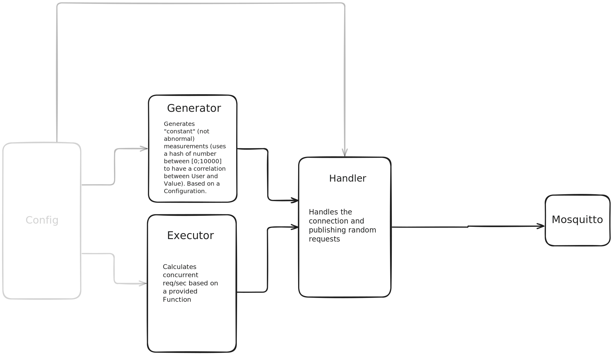

This is a simple Load-Generator which mocks an mqtt-client that publishes Health Data.

---
### Prerequisites

---
### Quick Start

Testing all tests
```shell
just test
```

---
### Approach & Overview

This Load-Generator was implemented to test the MVP-Setup for the 'Wearables-Project' to test whether MQTT is more suitable or an HTTP-Endpoint.
Therefore, this Generator must preserve different requirements, below in sections [Features](#features) this will be explain in more depth.
Generally was the idea to have a pluggable and ease-of-use load generator. Which can be configured declarative in a `yaml`-file.
In section [Examples](#examples) the configuration and the extensibility will be shown.

#### Components of the Load Generator


##### Generator
The Generator uses the configuration `kind: Generator` in the Config to generate Messages of n distinct types. The Generator is optimized to create "normal" measurements and no anomalies.
To achieve this the Generator uses the hash of the a number [0;10.000] which refers the amount of different device IDs. This is done to have correlated measurement and have a clean graph on the dashboard.

##### Executor
The Executor uses shell scripts to calculate how many requests are send in a second. 
Each Formula must have the fields, **base** which defines the request baseline and a field called **amp** which is and amplitude factor.
There is a default set of the load pattern are in `./default`.

##### Handler
The Handler handles the connection to the server and publishes the messages using the generated message and the calculated requests/sec.

---
### Features
tba...

---
### Examples
This an example for a configuration for the load generator:
```yaml
kind: Handler
handlers:
  mqtt:
    topic: "wearables-raw"
    broker: "tcp://localhost:1883"
    device-count: 10000
    plot-path: "./test/"
---
kind: Executor
distributions:
  sinusoidal:
    formula: "./scripts/sinusoidal.sh"
    base: 2000
    amp: 500
executor:
  name: "daily_health_simulation"
  execution-pattern: "linear"
  duration: 500
  steps:
    - distribution: "sinusoidal"
      duration: 500
---
kind: Generator
measurement-types:
  heart-rate:
    type: "HKQuantityTypeIdentifierHeartRate"
    source-name: "ESP32-Wecker"
    source-version: "9.0"
    min: 100
    max: 200
    unit: "count/min"
```

Example JSON which is generated by the Generator:
```JSON
{
  
}
```

Example shell script to calculate req/sec:

```shell
#!/bin/zsh

# Usage: ./sinusoidal.sh --base=2000 --amp=500 --t=100

BASE=0
AMP=0
T=0

for ARG in "$@"; do
  case $ARG in
    --base=*)
        BASE="${ARG#*=}"
        ;;
    --amp=*)
        AMP="${ARG#*=}"
        ;;
    --t=*)
        T="${ARG#*=}"
        ;;
  esac
done

# Calculates: base + amp *(2*pi/900 * t)
VALUE=$(echo "scale=6; $BASE + $AMP * s(2*3.141592653589793*$T/900)" | bc -l)

echo $VALUE
```